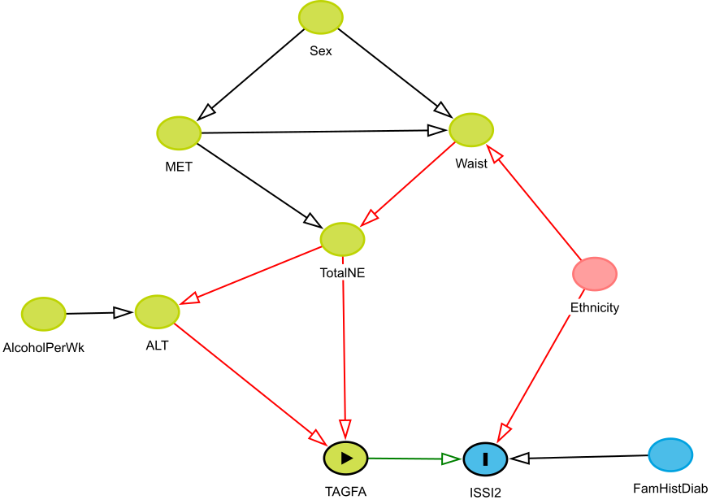

<!--

Outline:

- Primary analysis:
        - Sensitivity analysis with Carb intake? 

-->

# Title page

Title: Fatty acids involved in de novo lipogenesis within the serum
triacylglycerol fraction strongly predict lower insulin sensitivity.

Author: Luke W. Johnston (1), MSc; Stewart B. Harris (2), MD; Ravi Retnakaran
(3,4), MD; Adria Giacca (5), PhD; Zhen Liu (1), PhD;
Richard P. Bazinet (1), PhD; and Anthony J. Hanley (1,6), PhD

{{Bernie?}}

<!-- During time of study. -->
Affiliation:

(1) Department of Nutritional Sciences, University of Toronto, Toronto, Ontario, Canada.
(2) Centre for Studies in Family Medicine, University of Western Ontario, London, Ontario, Canada.
(3) Division of Endocrinology, University of Toronto, Toronto, ON, Canada.
(4) Lunenfeld Tanenbaum Research Institute, Mount Sinai Hospital, Toronto, Ontario, Canada.
(5) Department of Physiology, University of Toronto, Toronto, Ontario, Canada.
(6) Dalla Lana School of Public Health, University of Toronto, Toronto, Ontario, Canada.

Corresponding author:

- Name: Anthony J. Hanley
- Current address:  
    Department of Nutritional Sciences  
    Faculty of Medicine  
    University of Toronto  
    FitzGerald Building, 150 College Street, Room 341  
    Toronto, ON, Canada, M5S 3E2
- Phone number: 416.978.3616
- Fax number:
- Email: anthony.hanley@utoronto.ca

Disclaimers:

Funding support:

# Abstract

# Background

Hypertriglyceridemia is an extensively studied and well known factor involved in
the dysregulation of metabolic function and subsequent negative health impacts.
It is a component of the metabolic syndrome [@Alberti2009], a strong risk factor for
cardiovascular disease [@DAgostino2004a], and can contribute to the pathogenesis
of diabetes. Measuring triacylglcerides (TAG) within the blood is commonly done
during routine clinical visits as part of health assessment. However, clinically
measured TAG is limited as it represents all the types of fatty acids within the
TAG fraction as a single measure. Given the increasing appreciation for the role
of the specific fatty acid composition on health outcomes, for instance with
differences in associations of fatty acids within the PL lipid fraction
[@Forouhi2014a; @Ma2015a] including an analysis from the PROMISE cohort
[@Johnston2016a], there are relatively few studies that have explored this area
of research in the TAG fraction.

The interaction between TAG and insulin sensitivity is complex and has 
components of a feedback system. Greater resistance to insulin in both the liver
and muscle may result in greater production of TAG and secretion of lipoproteins
that transport TAG [@Yu2012a]. Likewise, greater TAGFA may contribute to 
metabolic dysfunction and lipotoxicity in various tissues, such as the 
beta-cells, and thus continuing the cycle. Given the complexity and temporal
nature of the relationship, long term studies with multiple data collections are
paramount to better understanding the underlying biology and subsequent risk.

While several prospective studies have identified a harmful association of 
hypertriglyceridemia on greater incidence for type 2 diabetes 
[@Chien2008a; @DAgostino2004a; @Schulze2009a], there are limited longitudinal
studies that have examined the relationship between TAG and it's composition on
the pathophysiological factors underlying diabetes, particularly in regard to
beta-cell function. Our objective was to examine the longitudinal role of the
specific composition of the serum TAG fraction on OGTT-derived measures of
insulin sensitivity and beta-cell function in an Canadian population at risk for
diabetes.

# Subjects and Methods

<!-- Use an external source via DOI for reference to these methods? -->

Recruitment for the baseline visit of the Prospective Metabolism and Islet Cell Evaluation (PROMISE) 
cohort took place between 2004-2006 from London and Toronto, 
Canada. Individuals were selected to participant if they met the eligibility 
criteria of having one or more risk factors for type 2 diabetes mellitus, 
including obesity, hypertension, family history of diabetes, and/or a history of
gestational diabetes or birth of a macrosomic infant. A total of 736 individuals
attended the baseline visit. Subsequent examinations occurred every three years,
with three examination visits completed to date (2004-2006, 2007-2009, and
2010-2013). Participants are contacted annually by telephone. The current study
sample used data on participants who did not have diabetes at baseline, who
returned for one or more of the follow-up examinations, and who had samples
available for fatty acid measurements (n=477; see the CONSORT diagram in 
Figure  1; a total of 423 attended all three
visits). Metabolic characterization, anthropometric
measurements, and questionnaires on lifestyle and sociodemographics are
collected at each examination visit. Research ethics approval was obtained from
Mount Sinai Hospital and the University of Western Ontario, and all participants
provided written informed consent. Data collection methods were standardized
across the 2 centres and research nurses were centrally trained.

## Metabolic characterization

Participants completed an 8-12 hour 75g oral glucose tolerance test (OGTT) at 
each examination visit, with blood samples taken during fasting, 30 min, and 2 hr 
post-glucose load. Samples were subsequently processed and frozen at -70°C.
Alanine aminotransferase (ALT) was measured using standard laboratory 
procedures. Cholesterol, HDL, and clinically-measured triacylglycerides (TAG) 
were measured using Roche Modular's enzymatic colorimetric tests (Mississauga, 
ON).  Both insulin and glucose were derived from the OGTT at fasting, 30 minute,
and 2 hour time points. Specific insulin was measured with the Elecsys 1010 
(Roche Diagnostics, Basel, Switzerland) immunoassay analyzer and 
electrochemiluminescence immunoassay, which shows 0.05% cross-reactivity to 
intact human pro-insulin and the Des 31,32 circulating split form (Linco Res. 
Inc) and has a coefficient of variation (CV) of 9.3%. Glucose was determined 
using an enzymatic hexokinase (Roche Modular, Roche Diagnostics) with a 
detection range of 0.11 to 41.6 mmol/L and an inter-assay %CV of <1.1% and an
intra-assay %CV of < 1.9%.  All assays were performed at the Banting and Best
Diabetes Centre Core Lab at Mt Sinai Hospital. Impaired fasting glucose (IFG),
impaired glucose tolerance (IGT), and diabetes were categorized using the 2006
WHO criteria [@WHO2006].

TAGFA composition was quantified using stored fasting serum samples from the 
baseline visit, which had been frozen at -70°C for 4-6 years and had not been 
exposed to any freeze-thaw cycles. Serum fatty acids have been documented to be 
stable at these temperatures for up to 10 years [@Matthan2010a]. A known amount 
of {{confirm with Richard the correct name}} heptadecanoic acid (17:0) was added as an internal
standard prior to extracting total lipids according to the method of Folch 
[@Folch1957a]. Each serum lipid fraction (non-esterified fatty acids (NEFA), 
cholesteryl ester, phospholipid, and TAGFA) was isolated using thin layer 
chromatography. Fatty acid methyl esters were separated and quantified using a 
Varian-430 gas chromatograph (Varian, Lake Forest, CA, USA) equipped with a 
Varian Factor Four capillary column and a flame ionization detector. Fatty acid 
concentrations (nmol/ml) were calculated by proportional comparison of gas
chromatography peak areas to that of the internal standards [@Nishi2014a]. There
were 22 fatty acids measured in the TAGFA fraction. Given that each lipid
fraction differs in biology and given the complexity of the analyses, findings
for other lipid fractions in this cohort are reported separately (see ref
@Johnston2016a for the analysis of the phospholipid and cholesteryl ester
fractions). 
<!--and {{next citation}} for the analysis of the NEFA fraction).-->

## Anthropometrics and sociodemographics

Height, weight, and waist circumference (WC) were measured at all clinic 
examinations using standard procedures.  WC was measured at the natural waist, 
defined as the narrowest part of the torso between the umbilicus and the xiphoid
process. BMI was calculated by dividing weight (kg) by height (m) squared.
Questionnaires administered at each examination determined sociodemographics.
A version of the Modifiable Activity Questionnaire (MAQ) [@Kriska1990]
determined estimated physical activity. The MAQ collects information on leisure
and occupational activity, including intensity, frequency, and duration, over
the past year. Each reported activity from the MAQ was weighted by its
metabolic intensity allowing for the estimation of MET-hours per week.

## Variable calculation and statistical analysis

Insulin sensitivity and beta-cell function indices were computed using the OGTT 
glucose and insulin data. Insulin sensitivity was assessed using HOMA2-%S
[@Levy1998a] using the HOMA2 Calculator and the Insulin Sensitivity Index (ISI)
[@Matsuda1999]. HOMA largely reflects hepatic insulin resistance, while ISI
reflects whole-body insulin sensitivity [@AbdulGhani2007]. Beta-cell function
was assessed using the Insulinogenic Index [@Wareham1995] over HOMA-IR [@Matthews1985] (IGI/IR)
and the Insulin Secretion-Sensitivity Index-2 (ISSI-2) [@Retnakaran2009]. IGI/IR
is a measure of the first phase of insulin secretion while ISSI-2 is analogous to
the disposition index (but using OGTT values). Each index has been validated
against gold standard measures [@Matthews1985; @Hermans1999a; @Matsuda1999; @Retnakaran2009].
Specific formulas for each OGTT-derived measure can be found in the {{
Supplementary Material }}.

The primary outcome variables for this analysis were HOMA2-%S, ISI, IGI/IR, and
ISSI-2, which were log-transformed for the statistical modeling. The primary
predictor variables for this analysis were 22 individual TAGFA as mole percent
(mol%) of the total fraction and as concentration (nmol/mL). Clinically-measured
TAG is also included as a primary predictor to serve as a comparison against the
TAGFA composition. A limitation with the clinically-measured TAG is that it was
only quantified on a portion of the participants at the 6-year visit (n = 126).
Pearson correlation coefficients were computed to assess the relationships of
individual TAGFA with other continuous variables. Correlations were also
computed for TAGFA against each other, followed by using hierarchical clustering
analysis to identify clusters within the correlation matrix of the TAGFA
composition.

Generalized estimating equation (GEE) models [@Zeger1986a] were used in the
primary analysis to determine the longitudinal associations between the outcome
variables and the predictor variables. Given the longitudinal design, an
auto-regressive of order 1 (AR1) working correlation matrix was chosen for the GEE
models as it had the best model fit when assessed using quasi-likelihood
information criteria (QIC), though other matrices (eg. exchangeable)
had similar fit (data not shown). GEE is well suited to longitudinal cohort 
studies given it's capacity to handle missed visits. The predictor variables and
continuous covariates were scaled (mean-centered and standardized). The TAGFA,
total NEFA, sex, ethnicity, and baseline age were classified as 
*time-independent* (held constant) as they were measured only at the baseline 
visit or do not change throughout the study, while the outcome variables and 
remaining covariates were set as *time-dependent*. No imputation was conducted 
on missing values. Given how the samples for TAGFA measurement were determined
and how the outcome variables are calculated, cases of diabetes at baseline and
followup were not included in the GEE modeling.

Covariates were selected based on the previous literature, from directed acyclic
graph [@Greenland1999a] recommendations (using the DAGitty software
[@Textor2011a], http://dagitty.net/; see Figure  2 and Figure  3), and from
QIC. Table  1 shows the covariates compared using QIC.
While the final GEE model selected as best fitting differed between insulin
sensitivity and beta-cell function measures, the differences in QIC values were
less than 10 between many of the models, suggesting similar fit. As such, we selected
the model that had the fewest covariates and that had similar fit between the
outcome measures. The final GEE model was adjusted for time, waist
circumference, baseline age, ethnicity, sex, ALT, MET, and total NEFA.
After scaling, log-transforming, and exponentiating, the GEE estimates are 
interpreted as an expected percent difference in the outcome variable for every 
standard deviation (SD) increase in the predictor variable given the covariates 
are held constant (including time). Lastly for the GEE models, we tested for an
interaction with sex, ethnicity, or time by the predictor term for each outcome
variable.

While GEE accounts for the longitudinal design of the data, this approach is 
limited in that it cannot analyze the inherent multivariate nature of the 
composition of the TAGFA fraction. To confirm the GEE results in a multivariate 
environment (all TAGFA), partial least squares regression (PLS) was
used to identify the patterns of TAGFA composition against insulin sensitivity
and beta-cell function. No prevalent diabetes cases were included in the PLS
analysis. For more detailed explanation of GEE and PLS, please see the
{{supplemental}} Methods.

All analyses were performed using R 3.3.1 [@Rbase], along with the R
packages geepack 1.2.1 for GEE [@Hoejsgaard2006a] and pls
2.6.0 for PLS. The R code and extra analyses for
this manuscript is available at {{code doi}}. Results were considered
statistically significance at p<0.05, after adjusting for multiple testing using
the Benjamini-Hochberg False Discovery Rate [@Benjamini1995a]. STROBE was used
as a guideline for reporting [@Vandenbroucke2007b].

# Results

## Basic characteristics of the PROMISE cohort

Table  2 shows some basic characteristics of the PROMISE cohort. The mean 
follow-up time was 5.6 (1.0), where 88.7%
of participants attended all three visits. There were
349 (73.2%) females and 336 (70.4%) who had European-ancestry, with a mean
age in years of 50.1 (9.8) and a mean BMI
of 31.1 (6.4). Given the eligibility criteria, the majority of
participants (308 (64.8%)) had a family history of diabetes.
Between the baseline visit and the 6-year visit in this sample, insulin
sensitivity and beta-cell function measures had a significant median decline
between 14% to 27% (p<0.001 from GEE; n=367-470). There 
were 42 (9%) and 96 (20%) incident cases of diabetes and
pre-diabetes (IFG and IGT), respectively. 

Figure  4 shows the composition of each FA in the TAG fraction (see 
Table  3 for a tabular presentation of the values). 
Three TAGFA contributed 82.4% to the total 
TAG concentration: 18:1n-9 (37.8%); 16:0 (26.6%); and, 18:2n-6 (18.0%).
Figure  5 shows a heatmap of the correlation of individual TAGFA with the
outcome variables and several basic characteristics.
As expected, nearly all TAGFA had very strong positive correlations (r=
0.33 to 0.92) with clinically-measured TAG and moderate positive 
correlations with WC (r=0.31 to 0.36). There was also moderate
negative correlations with HDL (r=-0.53 to -0.32). For the outcome variables,
the correlations for the insulin sensitivity measures were generally higher 
(HOMA2-%S: r=-0.48 to -0.32, ISI: r=-0.48 to -0.33) than 
for the beta-cell function measures (all r<0.30).

## Generalized estimating equation models

There were 141 FDR-corrected 
significant associations in the unadjusted GEE model (see Figure  7) and 
88 FDR-corrected
significant associations in the adjusted GEE model as shown in Figure  8. 
The majority of associations with beta-cell function measures were attenuated
after full model adjustment, while nearly all associations with insulin
sensitivity remained significant. 
<!--{{ confirm }} Subsequent analysis revealed
that the attenuation with beta-cell function was due primarily to adjustment for
{{ waist? ALT? }}.-->

As a concentration, nearly all TAGFA had a strong negative association on
HOMA2-%S and ISI (estimates ranging from 
-13.7 to -3.6 and -14.7 to -4.4, respectively), and a
few had strong negative associations with IGI/IR and ISSI-2 (estimates ranging 
from -7.4 to -7.3 and -4.1 to -3.4, respectively).
As a mol%, four TAGFA (14:0, 16:0, 14:1n-7, and 16:1n-7) had negative
associations with HOMA2-%S and ISI (between -11.6 to -5.7 and 
-12.3 to -5.8%, respectively, lower insulin sensitivity for every SD
increase in the TAGFA), while several more TAGFA had positive associations with
HOMA2-%S and ISI (20:0, 18:1n-9, 20:1n-9, 22:1n-9, 18:2n-6, 20:2n-6, 20:4n-6,
and 22:5n-3) predicting between 4.3 to 14.2 and 
5.8 to 15.2%, respectively, higher insulin sensitivity for every
SD increase in the TAGFA. One TAGFA, 20:2n-6, had a very strong positive
association with the insulin sensitivity measures, with a 14.2
to 15.2% higher insulin sensitivity for every SD increase in 
20:2n-6. 

Both clinically-measured TAG and total TAGFA concentration had very strong
negative associations with all outcome variables. There were no significant
interactions by time, sex, or ethnicity for any of the TAGFA (data not shown).
A tabular presentation of the GEE results is shown in Table  4 
for unadjusted models and Table  5 for adjusted models.

## Clustering of TAGFA by metabolic measures

To determine which components to use, internal CV showed that the first two
components gave the highest amount of explained variance (data not shown).
Confirming the findings from the GEE models, PLS analysis on the beta-cell
function measures revealed that there was a low correlation (though significant
at p<0.001) between the predicted values and the actual values (r=
0.25 to 0.24), suggesting poor predictability. While 
the clustering of TAGFA from the PLS results of the beta-cell function measures 
were similar to the insulin sensitivity measures, only the insulin sensitivity 
measures are presented given the higher predictive ability.

The PLS results for the insulin sensitivity (Figure  9) revealed a clustering 
of the fatty acids 14:0, 14:1n-7, 16:0, and 16:1n-7. These TAGFA loaded strongly (meaning
the fatty acids fell between the dashed and solid circles) and negatively on HOMA2-%S
and ISI, suggesting this cluster of TAGFA tracks together with lower insulin
sensitivity. The TAGFA 20:2n-6, 20:5n-3, 22:5n-3, and 22:6n-3 loaded positively
on both insulin sensitivity measures. No other TAGFA loaded strongly, the
results of which remained after running the PLS model on the cross-validated
testing set. The PLS model for insulin sensitivity had good predictive ability, 
determined by correlating the predicted outcome values with the actual values
(HOMA2-%S: r=0.46, p<0.001; ISI: r=0.39, p<0.001).

# Discussion

## Overall conclusion

We found that in an at-risk for diabetes Canadian population who were mainly female 
and of European ancestry, the specific TAGFA composition was strongly associated 
with insulin sensitivity and moderately associated with beta-cell function. In 
particular, TAGFA myristic acid (14:0), 7-tetradecenoic acid {{ confirm name }} 
(14:1n-7), palmitic acid (16:0), and palmitoleic acid (16:1n-7) all strongly and
negatively predicted lower insulin sensitivity. While most TAGFA were not
associated with beta-cell function, two fatty acids, 16:0 and 18:1n-7, were
associated negatively and positively, respectively, with both measures of 
beta-cell function. We also found that four TAGFA (14:0, 14:1n-7, 16:0, 16:1n-7)
clustered together, and that also strongly predicted lower insulin sensitivity. 
These four fatty acids are also involved in the DNL of refined and simple 
carbohydrates. Our results, which are in agreement with the current literature,
suggest that higher activity of DNL (potentially through higher intakes of
simple carbohydrates) may increase the risk for diabetes, likely through
worsening insulin sensitivity.

## Interpretation and previous literature

To our knowledge, no longitudinal study has examined the role of the composition
of the TAGFA fraction on detailed OGTT-derived metabolic measures using advanced
{{another word? appropriate?}} statistical techniques designed to maximally
utilize the data. Two large prospective studies have been published that had
similar research objectives as the present analysis. One was a nested
case-control cohort (n=189 cases and n=189 controls) of the Framingham offspring
study [@Rhee2011a], which found that TAGFA composition with a lower carbon chain
and less double bonds (e.g. 14:0, 16:0) had a higher risk for diabetes after 
12-years while higher carbon chain and more double bond TAGFA had a lower risk 
for diabetes. This pattern of TAGFA with diabetes risk remained the same when 
they examined HOMA-IR cross-sectionally at the baseline visit. The other study 
was a prospective cohort of males in Finland [@Lankinen2015a], of which they had
TAGFA data on 831 participants after 6-years from the baseline visit. This 
cohort has similar outcomes as PROMISE, however, OGTT data was only available at
the 6-year visit. A beta-cell function measure was computed, but only included 
calculations up to 30 minutes of the OGTT. As with our results, they found a 
larger effect size for insulin sensitivity compared to the beta-cell function. 
The specific TAGFA that associated with the metabolic measures were similar 
between studies, particularly with the four DNL fatty acids. A limitation of 
the study was the simpler statistical techniques used to analyze the data, 
which are not able to adequately use the longitudinal and high-dimensional 
dataset. {{ Their article and methods were ... questionable... }} In another 
study of a much smaller (n=16) mostly female group [@Kotronen2009a], the authors
report a positive correlation between total esterified (of which TAG make up the
majority) 16:0, 16:1n-7, and 18:1n-9 with HOMA-IR, similar as our results except
for the 18:1n-9 finding.

Previous research has shown that carbohydrate intake increases DNL 
[@Hodson2008a; @Kawano2013a; @Harding2015a; @Hudgins2000a; @Parks1999a]. In
particular, DNL from refined or simple carbohydrate sources increases the 14 to
16 chain fatty acids as well as the 18 chain TAGFA. Several studies have shown a
link between higher estimated DNL and an increased risk for metabolic 
dysfunction [@Ma2015a; @Zong2013a; @Lankinen2015a; @Kroger2011a]. Our study
extends these findings on DNL by showing that TAGFA with 14 to 16 carbons all
strongly predicted lower insulin sensitivity. While these fatty acids also had a
significant association with beta-cell function, the results were not as strong
as with the insulin sensitivity.

The link between higher DNL and increases in specific fatty acids has been
examined in several studies. Previous studies that have examined DNL have used
markers of estimated DNL, such as the ratio between 18:2n-6 to 16:0 or 16:1n-7
to 16:0 [@Hodson2008a; @Lankinen2015a; @Kroger2011a]. However, there are major
limitations to using these ratios as the fatty acids used in their calculation
can also be obtained from the diet in addition to being created through DNL
[@Hodson2008a]. A short, small feeding trial (n=24) was conducted to identify
fatty acids that most accurately reflected DNL, as potential biomarkers
[@Lee2015a]. The study found that palmitoleic acid (16:1n-7), directly measured
DNL using isotopes, and liver fat were all highly correlated with each other
(r>0.50), suggesting that 16:1n-7 may be a good biomarker for hepatic DNL. In
another small (n=14) feeding trial, meal type (high fat vs low fat) was tested
to determine its effect on DNL and TAGFA composition [@Wilke2009a]. The authors
reported that 14:0, 16:0, 16:1, and 18:2 were higher in the low fat (high
carbohydrate) group. These fatty acids are similar to the fatty acids we found
that clustered together using the PLS analysis, implicating these fatty acids as
indicative of a higher carbohydrate diet. A higher carbohydrate diet,
particularly with simple carbohydrates, may lead to greater DNL in an attempt to
control blood glucose, increasing hepatic fat stores, and increasing the amount
of TAGFA in circulation. The higher concentration of circulating 14 and 16
carbon fatty acids may then expose tissues to greater lipotoxicity, for instance
from palmitic acid (16:0), which is well-known to have harmful effects on
tissues [@Riserus2008a; @Iggman2010a].

We found no interaction by time for any of the TAGFA on the metabolic outcomes.
Analyzing these biological processes longitudinally is challenging due to the
potential feedback mechanisms involved. For instance, while greater DNL may
promote muscle insulin resistance, the reverse may also be true
[@Flannery2012a]. Higher insulin resistance may encourage greater DNL to handle
the higher blood glucose. To illustrate this, in a weight loss intervention trial
(n=19 with TAGFA data), participants who lost weight over 33 weeks showed higher
insulin sensitivity and lower TAGFA composition indicative of lower DNL (less
14:0, 14:1, 16:0, 16:1, etc) [@Schwab2008a]. Given the complex biological
mechanisms and feedback loops involved, disentangling whether insulin
sensitivity influences TAGFA more strongly than TAGFA influencing insulin
sensitivity will require more complicated research designs and analyses. Our own
null results on this question may tentatively point to an equally influential
feedback mechanism between TAGFA and insulin sensitivity.

Serum TAG are packaged into lipoproteins, particularly VLDL, by the liver. The
sources of fatty acids for TAG production during fasting are stored fatty acids
within the liver, circulating NEFA, and through DNL [@Barrows2006a]. Therefore, the
TAGFA composition reflects not just dietary intake but also stored fatty acids
from the adipose tissue and the DNL capacity of the individual. During fasting, a
large portion of fatty acids bound together as TAG are obtained from circulating
NEFA. A study examining this found that NEFA contributed 60-80% of newly synthesized
VLDL-TAG during fasting and ~40% during the fed state while dietary fatty acids
contributed ~25% to newly synthesized VLDL-TAG [@Barrows2006a]. In an analysis of the
serum NEFA fraction in the PROMISE cohort with the OGTT-derived outcomes
(currently unpublished), we found that higher total NEFA but not the specific
composition associated with lower beta-cell function and not with insulin 
resistance. While NEFA may contribute substantially to the TAG fraction, there 
may be something unique about the specific composition of the TAGFA fraction 
that may allow it to enter insulin sensitive tissues more easily than NEFA. It 
may be that VLDL receptors allow fatty acids to enter these tissue more easily
than NEFA bound to albumin, or it may be due to the other influences on TAGFA 
composition such as dietary intake.

{{ Not sure about this... Include this? }}
As with our previous analysis of the PL fatty acid fraction {{cite}}, we found
that cis-vaccenic acid strongly predicted higher insulin sensitivity and
beta-cell function. Likewise, in the TAGFA fraction we found a similar
association with cis-vaccenic acid. {{we can discuss to include more}}

<!--
{{ comment on comparing models with and without NEFA }} While
NEFA may be a mediating factor, we found that adjustment for it did not
{{confirm}} attenuate this association since TAGFA composition is also dictated
by other sources for DNL (e.g. recent meal, DNL from glucose stores, etc.).

While the NEFA fraction is much smaller than the TAG fraction, even though it
contributes substantially to the TAG fraction, the VLDL-TAG is not cleared
(lipolyzed) as much as chylomicron (which also contains a large amount of TAG)
and so has a higher half-life than NEFA, remaining in circulation longer {{hence
why there is bigger TAG pool vs NEFA}} {{cite?}}. 

- contributions to DNL (e.g. 70% 16:0 to newly synth) {{ confirm what this is }}

- Zulyniak2012a (only vaccenic acid in TAG) (n=20, TLC-GC, HOMA-IR/HOMA-B,
two groups: normogly and hypergly. results in general showed no diff between
groups, only cis-vaccenic was higher in hyper, 'trend' with palmitic, did
not present results on whole fraction for IR)
    
{{ comment on unadjusted vs adjusted }}

- Potential clinical application

- Or that post-prandial TAG is not suppressed in IR Sondergaard2012a
- {{ confirm }} greater flux of saturated fatty acids into tissues may encourage
lipotoxic environment {{ cite }}

{{ Concentration data is not }}

-->

## Limitations

There are a few important limitations to our study. In addition to the
observational nature of the cohort, the biology underlying the interaction
between TAGFA, insulin secretion, and insulin sensitivity is complex and
multifaceted and as such there may be some residual confounding we were
unaware of or had not been able to adjust for. However, we have taken extensive,
empirically based precautions in identifying potential confounders and mediators
through the use of the DAG modeling, relying on previous literature, and through
QIC model fit comparison methods.

<!--
TAGFA can fluctuate substantially throughout the day and to control for this all
PROMISE participants came for their clinic visits in the morning in a fasted
state. Some of the inherent variability in TAGFA fluctuation can be managed by
standardizing the data collection time, though there may still be some
{{residual error? random error?}}.
[@Rhee2011a] fasting TAG status better as discriminating between DM case vs
control than 2hr-OGTT TAG
-->

TAGFA were only quantified at the baseline visit and as such we cannot
investigate whether there are concomitant changes in TAGFA and the metabolic
measures over time. In relation to this limitation, while GEE is well suited to
longitudinal datasets, the complex biology and temporal nature of the
associations may restrict the ability of GEE to appropriately analyze and
interpret the data. However, to maximize the potential of GEE, we used the model
to infer that a given value of TAGFA could predict values of insulin sensitivity
or beta-cell function over a 6 year period. This in our view is a strength of
our analysis, as it reduces the chance of reverse causality given the tight
integration of the glucose and fatty acid metabolism pathways, as well as
maximizes the specific usage of the GEE modeling.

PLS is a well-established technique for constructing predictive models of high
dimensionality data structures (i.e. fatty acid composition), however a 
limitation is that the initial models analyzed through PLS and the final 
computed scores are not able to control for potential confounders and other 
effect modifiers. Likewise, PLS is not able to handle longitudinal data so only 
the baseline visit was used in the PLS analysis. In light of these limitations, 
we still observe concordant results between the PLS and GEE analyses.

Even with these limitations, our study has several notable strengths, including
the longitudinal design and the rigorous statistical techniques and methods
applied in analyzing the data. These statistical techniques take advantage of
the longitudinal data to allow appropriate investigation of temporal
relationships and are able to handle the multivariate nature of the data.
Lastly, our cohort contains highly detailed and comprehensive variable
measurements at each collection visit, as well as having both concentration and
mol% data for the fatty acids.

## Final conclusion

In conclusion, we found that a TAGFA composition indicative of higher DNL
(containing higher 14:0, 14:1n-7, 16:0, and 16:1n-7) associated strongly lower
insulin sensitivity and moderately with lower beta-cell function. The fatty
acids that clustered together represent fatty acids created from DNL, which is
characteristic of higher simple carbohydrate (e.g. added sugar) intake. Our
results, which are congruent with current evidence, suggest that higher DNL
likely due to greater intake of simple or refined carbohydrates may increase the
risk of diabetes through worsening of insulin sensitivity.

# Acknowledgements

The authors thank Jan Neuman, Paula Van Nostrand, Stella Kink, and Annette
Barnie of the Leadership Sinai Centre for Diabetes, Mount Sinai Hospital,
Toronto, Canada and Sheila Porter and Mauricio Marin of the Centre for Studies
in Family Medicine, University of Western Ontario, London, Canada for their 
expert technical assistance and dedication in their work for PROMISE. 

## Funding

This study was supported by grants from the Canadian Diabetes Association (CDA),
the Canadian Institutes for Health Research, and the University of
Toronto Banting and Best Diabetes Centre; LWJ is supported by a CDA
Doctoral Student Research Award; RR is supported by a Heart and Stroke
Foundation of Ontario Mid-Career Investigator Award {{confirm}}; SBH holds the
CDA Chair in National Diabetes Management and the Ian McWhinney Chair of Family
Medicine Studies at the University of Western Ontario {{confirm}}; RBP holds a
Tier II Canada Research Chair in Brain Lipid Metabolism; AJH holds a Tier II
Canada Research Chair in Diabetes Epidemiology.

## Conflicts of interest

The authors report no potential conflicts of interest relevant to this study.

## Contribution statement

The authors had the following responsibility: LWJ conducted research, analyzed
data, and wrote the paper; RR, ZL, and SBH designed research, conducted
research, and provided essential materials (infrastructure and clinical
resources); RR, SBH, RPB, and AG provided intellectual feedback on the
paper; RPB conducted research, provided essential reagents and materials; AJH
designed research, assisted with interpretation, and provided intellectual
feedback on all versions of the paper; LWJ and AJH had primary responsibility
for final content. All authors read and approved the final manuscript.

{{Bernie?}}

# Tables

| Measure         |      Baseline       |        3-yr         |        6-yr         |
|:----------------|:-------------------:|:-------------------:|:-------------------:|
| HOMA2-%S        |  88.8 (54.2-136.7)  |  76.8 (49.1-121.8)  |  73.7 (49.5-110.1)  |
| ISI             |   13.6 (8.7-21.8)   |   11.6 (6.9-19.1)   |   11.6 (7.5-17.5)   |
| IGI/IR          |   7.1 (4.2-10.6)    |    5.6 (3.6-9.8)    |    5.6 (3.5-9.0)    |
| ISSI-2          | 727.5 (570.0-922.5) | 613.4 (493.9-836.7) | 622.5 (472.5-810.3) |
| ALT (U/L)       |     29.6 (16.0)     |     28.4 (19.5)     |     25.9 (16.9)     |
| TAG (mmol/L)    |      1.5 (0.8)      |      1.4 (0.8)      |      1.4 (0.7)      |
| Chol (mmol/L)   |      5.2 (0.9)      |      5.1 (1.0)      |      5.1 (0.9)      |
| HDL (mmol/L)    |      1.4 (0.4)      |      1.3 (0.4)      |      1.4 (0.4)      |
| TAGFA (nmol/mL) |   3137.5 (1686.6)   |                     |                     |
| NEFA (nmol/mL)  |    383.1 (116.3)    |                     |                     |
| MET             |     45.2 (59.7)     |     48.5 (60.5)     |     44.1 (57.1)     |
| Age (yrs)       |     50.1 (9.8)      |     53.2 (9.7)      |     56.5 (9.6)      |
| BMI (kg/m^2^)   |     31.1 (6.4)      |     31.4 (6.5)      |     31.1 (6.6)      |
| WC (cm)         |     98.5 (15.5)     |     99.3 (15.7)     |    100.4 (15.7)     |
| Ethnicity       |                     |                     |                     |
| - European      |      336 (70%)      |                     |                     |
| - Latino/a      |      58 (12%)       |                     |                     |
| - Other         |      51 (11%)       |                     |                     |
| - South Asian   |       32 (7%)       |                     |                     |
| Sex             |                     |                     |                     |
| - Female        |      349 (73%)      |                     |                     |
| - Male          |      128 (27%)      |                     |                     |

Table: Table  2: Basic characteristics of PROMISE participants at each of the 3 clinic visits.

| TAGFA   |  Concentrations (nmol/mL)  |  Proportion (mol%)  |
|:--------|:--------------------------:|:-------------------:|
| 18:3n-3 |        45.2 (31.1)         |      1.5 (0.6)      |
| 20:5n-3 |         9.9 (8.1)          |      0.4 (0.4)      |
| 22:5n-3 |         8.3 (5.7)          |      0.3 (0.2)      |
| 22:6n-3 |        16.7 (14.5)         |      0.6 (0.6)      |
| 18:2n-6 |       548.6 (298.7)        |     18.0 (4.2)      |
| 18:3n-6 |         15.1 (9.9)         |      0.5 (0.2)      |
| 20:2n-6 |         10.2 (4.7)         |      0.4 (0.1)      |
| 20:3n-6 |         10.2 (6.0)         |      0.3 (0.1)      |
| 20:4n-6 |        38.2 (19.1)         |      1.3 (0.5)      |
| 22:4n-6 |         4.6 (2.9)          |      0.1 (0.1)      |
| 14:1n-7 |         5.1 (6.1)          |      0.1 (0.1)      |
| 16:1n-7 |        126.1 (98.8)        |      3.8 (1.3)      |
| 18:1n-7 |        71.6 (34.8)         |      2.4 (0.4)      |
| 18:1n-9 |       1168.5 (592.2)       |     37.8 (3.7)      |
| 20:1n-9 |         8.5 (5.2)          |      0.3 (0.2)      |
| 22:1n-9 |         1.0 (0.6)          |      0.0 (0.0)      |
| 24:1n-9 |         2.2 (4.0)          |      0.1 (0.1)      |
| 14:0    |        62.4 (59.0)         |      1.8 (1.0)      |
| 16:0    |       868.0 (556.2)        |     26.6 (4.4)      |
| 18:0    |        113.6 (63.4)        |      3.7 (0.8)      |
| 20:0    |         1.9 (1.3)          |      0.1 (0.0)      |
| 22:0    |         1.5 (1.2)          |      0.1 (0.0)      |
| Total   |      3137.5 (1686.6)       |                     |

Table: Table  3: Concentration (nmol/mL) and relative percent (mol%) values of triacylglycerol fatty acids in PROMISE participants at the baseline visit (2004-2006).

| Fatty acid   | log(HOMA2-%S)          | log(ISI)               | log(IGI/IR)            | log(ISSI-2)           |
|:-------------|:-----------------------|:-----------------------|:-----------------------|:----------------------|
| **Totals**   |                        |                        |                        |                       |
| Clinical TAG | -25.0 (-29.1, -20.8)\* | -24.6 (-28.4, -20.7)\* | -18.5 (-24.2, -12.3)\* | -11.1 (-14.4, -7.6)\* |
| Total        | -22.4 (-27.8, -16.7)\* | -23.1 (-28.5, -17.2)\* | -15.8 (-22.2, -8.8)\*  | -9.2 (-13.2, -5.1)\*  |
| **nmol/mL**  |                        |                        |                        |                       |
| 14:0         | -19.1 (-23.7, -14.2)\* | -19.6 (-24.2, -14.8)\* | -10.8 (-16.5, -4.7)\*  | -6.7 (-10.0, -3.2)\*  |
| 16:0         | -23.2 (-28.5, -17.5)\* | -23.9 (-29.2, -18.2)\* | -16.4 (-22.9, -9.4)\*  | -9.6 (-13.5, -5.4)\*  |
| 18:0         | -21.1 (-26.6, -15.2)\* | -21.6 (-27.3, -15.5)\* | -15.3 (-21.8, -8.2)\*  | -9.0 (-12.9, -4.9)\*  |
| 20:0         | -13.1 (-17.1, -8.9)\*  | -13.0 (-17.6, -8.2)\*  | -8.4 (-13.7, -2.7)\*   | -5.7 (-8.6, -2.8)\*   |
| 22:0         | -12.6 (-17.1, -7.9)\*  | -13.1 (-17.8, -8.2)\*  | -2.2 (-7.9, 3.9)       | -1.9 (-4.7, 1.0)      |
| 18:1n-9      | -21.6 (-26.2, -16.8)\* | -22.1 (-26.8, -17.1)\* | -15.9 (-21.8, -9.5)\*  | -9.1 (-12.6, -5.4)\*  |
| 20:1n-9      | -15.0 (-19.2, -10.7)\* | -14.9 (-19.0, -10.6)\* | -12.7 (-18.8, -6.2)\*  | -7.0 (-10.2, -3.6)\*  |
| 22:1n-9      | -13.8 (-19.3, -7.8)\*  | -11.9 (-18.1, -5.3)\*  | -11.1 (-15.7, -6.4)\*  | -5.5 (-8.1, -2.9)\*   |
| 24:1n-9      | -4.5 (-8.6, -0.2)      | -6.4 (-10.7, -1.8)\*   | 4.0 (-1.6, 9.8)        | 2.0 (-0.7, 4.7)       |
| 14:1n-7      | -14.8 (-19.3, -10.1)\* | -15.2 (-19.7, -10.4)\* | -9.0 (-14.4, -3.2)\*   | -5.4 (-8.4, -2.3)\*   |
| 16:1n-7      | -19.3 (-24.4, -13.8)\* | -19.8 (-25.0, -14.4)\* | -14.2 (-20.7, -7.1)\*  | -8.1 (-12.0, -4.1)\*  |
| 18:1n-7      | -22.3 (-26.2, -18.3)\* | -22.9 (-26.9, -18.7)\* | -16.0 (-21.3, -10.4)\* | -9.0 (-12.0, -5.9)\*  |
| 18:2n-6      | -19.0 (-23.7, -14.0)\* | -19.5 (-24.3, -14.4)\* | -12.0 (-17.7, -5.8)\*  | -7.2 (-10.7, -3.6)\*  |
| 18:3n-6      | -13.3 (-18.2, -8.1)\*  | -13.2 (-18.4, -7.8)\*  | -9.1 (-15.0, -2.8)\*   | -5.3 (-8.8, -1.7)\*   |
| 20:2n-6      | -15.8 (-20.9, -10.4)\* | -16.3 (-21.5, -10.9)\* | -12.8 (-19.3, -5.9)\*  | -6.8 (-10.7, -2.8)\*  |
| 20:3n-6      | -17.7 (-22.8, -12.2)\* | -18.5 (-23.7, -13.0)\* | -12.5 (-18.6, -5.9)\*  | -7.3 (-10.9, -3.4)\*  |
| 20:4n-6      | -17.2 (-24.6, -9.1)\*  | -18.3 (-25.9, -9.9)\*  | -13.3 (-21.6, -4.1)\*  | -7.5 (-12.7, -1.9)\*  |
| 22:4n-6      | -18.1 (-25.8, -9.6)\*  | -18.7 (-26.4, -10.2)\* | -10.1 (-17.6, -1.9)\*  | -5.8 (-10.4, -0.9)\*  |
| 18:3n-3      | -15.8 (-19.7, -11.7)\* | -16.8 (-20.7, -12.6)\* | -9.5 (-14.3, -4.5)\*   | -6.0 (-8.6, -3.3)\*   |
| 20:5n-3      | -5.5 (-9.3, -1.5)\*    | -8.4 (-12.2, -4.5)\*   | -3.7 (-8.5, 1.3)       | -3.2 (-5.8, -0.5)\*   |
| 22:5n-3      | -7.7 (-11.8, -3.3)\*   | -8.0 (-12.3, -3.5)\*   | -11.0 (-15.7, -5.9)\*  | -6.7 (-9.1, -4.2)\*   |
| 22:6n-3      | -7.3 (-11.1, -3.3)\*   | -10.1 (-14.0, -6.0)\*  | -4.2 (-8.6, 0.4)       | -3.4 (-5.9, -0.9)\*   |
| **mol%**     |                        |                        |                        |                       |
| 14:0         | -14.0 (-17.8, -10.0)\* | -13.8 (-17.8, -9.6)\*  | -4.8 (-10.5, 1.4)      | -3.6 (-6.6, -0.6)\*   |
| 16:0         | -20.0 (-23.6, -16.2)\* | -20.4 (-24.2, -16.5)\* | -13.5 (-18.9, -7.7)\*  | -8.0 (-10.9, -5.0)\*  |
| 18:0         | 3.7 (-0.9, 8.6)        | 3.4 (-1.4, 8.3)        | 1.4 (-5.2, 8.5)        | 0.5 (-2.7, 3.8)       |
| 20:0         | 9.5 (2.5, 16.9)\*      | 9.6 (2.3, 17.4)\*      | 7.6 (0.8, 15.0)\*      | 3.0 (-0.6, 6.7)       |
| 22:0         | 4.2 (-0.7, 9.3)        | 4.2 (-0.4, 8.9)        | 11.0 (5.1, 17.2)\*     | 5.2 (2.6, 7.9)\*      |
| 18:1n-9      | 14.6 (9.1, 20.4)\*     | 15.5 (9.5, 22.0)\*     | 5.6 (-0.5, 12.0)       | 4.4 (1.4, 7.5)\*      |
| 20:1n-9      | 7.3 (1.9, 13.1)\*      | 8.2 (2.3, 14.4)\*      | 2.1 (-4.8, 9.6)        | 1.8 (-2.0, 5.7)       |
| 22:1n-9      | 10.3 (4.8, 16.1)\*     | 12.7 (7.1, 18.6)\*     | 6.6 (-0.3, 14.0)       | 4.3 (0.8, 7.8)\*      |
| 24:1n-9      | 3.2 (-1.5, 8.0)        | 1.4 (-3.2, 6.3)        | 10.5 (4.3, 17.0)\*     | 4.7 (1.8, 7.8)\*      |
| 14:1n-7      | -10.0 (-14.2, -5.6)\*  | -9.6 (-14.0, -5.0)\*   | -4.1 (-9.7, 2.0)       | -2.8 (-5.7, 0.3)      |
| 16:1n-7      | -10.9 (-15.2, -6.4)\*  | -10.7 (-15.2, -6.0)\*  | -8.5 (-14.2, -2.3)\*   | -5.0 (-7.9, -1.9)\*   |
| 18:1n-7      | 7.2 (1.7, 12.9)\*      | 7.9 (2.4, 13.8)\*      | 5.3 (-1.0, 12.0)       | 3.8 (0.7, 7.0)\*      |
| 18:2n-6      | 12.6 (6.7, 18.8)\*     | 13.1 (7.1, 19.6)\*     | 10.0 (3.4, 17.1)\*     | 5.1 (1.9, 8.5)\*      |
| 18:3n-6      | 8.4 (3.7, 13.2)\*      | 10.3 (5.5, 15.3)\*     | 7.3 (1.2, 13.8)\*      | 3.9 (1.0, 6.9)\*      |
| 20:2n-6      | 21.4 (16.2, 26.9)\*    | 21.9 (16.3, 27.7)\*    | 9.3 (2.9, 16.2)\*      | 6.6 (3.5, 9.8)\*      |
| 20:3n-6      | 4.3 (-0.1, 9.0)        | 3.6 (-1.0, 8.4)        | 1.6 (-3.2, 6.8)        | 0.7 (-1.7, 3.2)       |
| 20:4n-6      | 10.1 (5.0, 15.4)\*     | 8.9 (3.1, 15.0)\*      | 3.5 (-2.4, 9.8)        | 2.4 (-0.5, 5.4)       |
| 22:4n-6      | 1.6 (-3.1, 6.4)        | 1.6 (-3.0, 6.3)        | 6.1 (-0.5, 13.1)       | 3.3 (0.4, 6.4)\*      |
| 18:3n-3      | 5.7 (0.6, 11.1)\*      | 5.3 (-0.2, 11.2)       | 5.9 (-1.0, 13.3)       | 2.3 (-1.0, 5.7)       |
| 20:5n-3      | 8.2 (1.7, 15.0)\*      | 4.7 (-1.9, 11.6)       | 7.1 (1.6, 12.9)\*      | 2.6 (-0.1, 5.4)       |
| 22:5n-3      | 12.9 (7.4, 18.6)\*     | 12.1 (6.0, 18.5)\*     | 3.2 (-2.8, 9.5)        | 1.6 (-1.4, 4.6)       |
| 22:6n-3      | 5.4 (0.2, 10.8)        | 2.2 (-3.0, 7.7)        | 5.6 (0.6, 10.9)\*      | 2.0 (-0.6, 4.7)       |

Table: Table  4: Raw estimates and confidence interval values for *time*-adjusted GEE models of the association of the triacylglycerol fatty acids (mol% and nmol/mL) and total clinically-measured TAG with insulin sensitivity and beta-cell function outcomes using the 6 year longitudinal data from the PROMISE cohort. Estimates represent a percent difference in the outcome per SD increase in the fatty acid. P-values were adjusted for the BH false discovery rate, with an asterisk (*) denoting a significant (p<0.05) association.

| Fatty acid   | log(HOMA2-%S)          | log(ISI)               | log(IGI/IR)          | log(ISSI-2)         |
|:-------------|:-----------------------|:-----------------------|:---------------------|:--------------------|
| **Totals**   |                        |                        |                      |                     |
| Clinical TAG | -16.7 (-20.6, -12.5)\* | -16.8 (-20.5, -12.9)\* | -9.5 (-15.1, -3.5)\* | -5.9 (-8.8, -2.8)\* |
| Total        | -13.3 (-17.5, -9.0)\*  | -14.3 (-18.7, -9.7)\*  | -6.8 (-12.3, -1.0)\* | -3.7 (-6.7, -0.6)\* |
| **nmol/mL**  |                        |                        |                      |                     |
| 14:0         | -11.0 (-14.5, -7.3)\*  | -12.1 (-15.8, -8.2)\*  | -4.1 (-9.0, 1.0)     | -2.5 (-5.0, 0.1)    |
| 16:0         | -13.7 (-17.8, -9.4)\*  | -14.7 (-19.0, -10.2)\* | -7.3 (-12.8, -1.5)\* | -3.9 (-6.9, -0.8)\* |
| 18:0         | -12.5 (-16.6, -8.1)\*  | -13.2 (-17.7, -8.5)\*  | -7.4 (-13.0, -1.4)\* | -4.1 (-7.2, -1.0)\* |
| 20:0         | -7.2 (-10.5, -3.8)\*   | -7.7 (-11.6, -3.6)\*   | -4.5 (-9.6, 1.0)     | -3.4 (-5.9, -0.7)\* |
| 22:0         | -8.6 (-12.4, -4.7)\*   | -8.5 (-12.7, -4.2)\*   | -1.5 (-7.0, 4.2)     | -1.5 (-4.0, 1.0)    |
| 18:1n-9      | -12.7 (-16.5, -8.8)\*  | -13.6 (-17.8, -9.3)\*  | -6.5 (-11.9, -0.7)   | -3.4 (-6.3, -0.4)   |
| 20:1n-9      | -7.7 (-10.7, -4.5)\*   | -7.9 (-11.3, -4.3)\*   | -5.3 (-10.7, 0.4)    | -2.4 (-5.1, 0.3)    |
| 22:1n-9      | -6.2 (-10.1, -2.2)\*   | -4.8 (-9.3, 0.0)       | -4.2 (-9.1, 0.9)     | -1.2 (-3.6, 1.2)    |
| 24:1n-9      | -3.6 (-6.5, -0.5)\*    | -4.4 (-7.8, -1.0)\*    | 1.6 (-3.3, 6.7)      | 0.8 (-1.5, 3.1)     |
| 14:1n-7      | -7.8 (-11.1, -4.4)\*   | -8.8 (-12.3, -5.2)\*   | -3.2 (-8.0, 1.8)     | -1.8 (-4.1, 0.6)    |
| 16:1n-7      | -10.1 (-13.8, -6.2)\*  | -10.9 (-14.8, -6.8)\*  | -5.1 (-10.6, 0.7)    | -2.5 (-5.2, 0.4)    |
| 18:1n-7      | -12.3 (-16.1, -8.3)\*  | -12.9 (-17.2, -8.5)\*  | -5.2 (-10.7, 0.8)    | -2.3 (-5.1, 0.6)    |
| 18:2n-6      | -12.1 (-15.9, -8.1)\*  | -12.7 (-16.7, -8.5)\*  | -5.7 (-10.8, -0.2)   | -3.4 (-6.3, -0.5)\* |
| 18:3n-6      | -8.3 (-12.1, -4.3)\*   | -8.7 (-13.0, -4.2)\*   | -5.5 (-10.5, -0.2)   | -3.0 (-5.7, -0.2)   |
| 20:2n-6      | -8.2 (-11.9, -4.2)\*   | -8.8 (-12.9, -4.5)\*   | -5.0 (-10.1, 0.2)    | -2.1 (-4.8, 0.7)    |
| 20:3n-6      | -9.5 (-13.0, -5.8)\*   | -10.5 (-14.3, -6.5)\*  | -4.7 (-9.4, 0.3)     | -2.5 (-5.1, 0.1)    |
| 20:4n-6      | -9.3 (-14.0, -4.3)\*   | -10.5 (-15.6, -5.0)\*  | -6.3 (-12.2, -0.1)   | -3.2 (-6.5, 0.3)    |
| 22:4n-6      | -9.9 (-14.8, -4.7)\*   | -10.5 (-15.4, -5.2)\*  | -4.2 (-9.5, 1.4)     | -2.1 (-5.0, 1.0)    |
| 18:3n-3      | -10.2 (-13.4, -7.0)\*  | -11.2 (-14.6, -7.8)\*  | -5.3 (-10.1, -0.3)   | -3.5 (-5.8, -1.1)\* |
| 20:5n-3      | -3.3 (-6.5, 0.0)       | -6.0 (-9.4, -2.4)\*    | -1.0 (-5.2, 3.5)     | -1.7 (-3.8, 0.5)    |
| 22:5n-3      | -2.8 (-6.3, 0.9)       | -3.9 (-7.9, 0.3)       | -2.8 (-7.7, 2.3)     | -2.2 (-4.5, 0.1)    |
| 22:6n-3      | -4.9 (-8.5, -1.2)\*    | -7.2 (-11.0, -3.3)\*   | -0.2 (-4.2, 3.9)     | -1.4 (-3.4, 0.7)    |
| **mol%**     |                        |                        |                      |                     |
| 14:0         | -9.0 (-12.0, -5.9)\*   | -9.7 (-13.1, -6.2)\*   | -2.1 (-7.1, 3.1)     | -1.9 (-4.3, 0.6)    |
| 16:0         | -11.6 (-14.7, -8.3)\*  | -12.3 (-15.8, -8.7)\*  | -6.3 (-11.4, -1.0)\* | -3.4 (-5.9, -0.8)\* |
| 18:0         | 2.2 (-1.3, 5.9)        | 1.9 (-1.9, 5.9)        | -1.6 (-7.4, 4.6)     | -1.3 (-4.0, 1.4)    |
| 20:0         | 5.9 (1.6, 10.5)\*      | 5.9 (1.1, 10.9)\*      | 2.5 (-3.2, 8.5)      | 0.3 (-2.7, 3.3)     |
| 22:0         | 1.0 (-2.3, 4.4)        | 1.6 (-1.8, 5.1)        | 3.7 (-2.5, 10.4)     | 1.1 (-1.5, 3.8)     |
| 18:1n-9      | 8.7 (4.4, 13.1)\*      | 9.0 (4.1, 14.1)\*      | 4.4 (-1.1, 10.3)     | 3.5 (0.7, 6.3)\*    |
| 20:1n-9      | 5.4 (1.1, 9.8)\*       | 6.2 (1.1, 11.5)\*      | 1.9 (-4.4, 8.7)      | 1.6 (-2.0, 5.3)     |
| 22:1n-9      | 7.3 (3.4, 11.3)\*      | 8.9 (4.7, 13.3)\*      | 4.1 (-1.8, 10.4)     | 2.8 (0.0, 5.7)      |
| 24:1n-9      | 0.6 (-3.0, 4.3)        | 0.3 (-3.6, 4.4)        | 4.2 (-1.6, 10.3)     | 1.2 (-1.3, 3.9)     |
| 14:1n-7      | -6.0 (-9.2, -2.7)\*    | -6.6 (-10.1, -2.9)\*   | -1.3 (-6.2, 3.9)     | -0.9 (-3.3, 1.5)    |
| 16:1n-7      | -5.7 (-9.1, -2.2)\*    | -5.8 (-9.5, -1.8)\*    | -1.9 (-7.6, 4.3)     | -0.9 (-3.6, 2.0)    |
| 18:1n-7      | 7.8 (3.7, 12.2)\*      | 8.8 (4.3, 13.5)\*      | 8.3 (2.4, 14.5)\*    | 5.4 (2.7, 8.2)\*    |
| 18:2n-6      | 5.4 (1.2, 9.9)\*       | 6.8 (2.1, 11.8)\*      | 2.1 (-3.3, 7.7)      | 0.6 (-2.0, 3.3)     |
| 18:3n-6      | 2.9 (-1.1, 7.1)        | 4.3 (-0.2, 9.0)        | 0.3 (-5.2, 6.0)      | 0.1 (-2.5, 2.8)     |
| 20:2n-6      | 14.2 (10.2, 18.3)\*    | 15.2 (10.8, 19.9)\*    | 4.5 (-1.1, 10.5)     | 3.8 (1.1, 6.6)\*    |
| 20:3n-6      | 4.3 (0.7, 8.0)\*       | 4.1 (0.1, 8.2)         | 1.2 (-3.1, 5.7)      | 0.6 (-1.5, 2.8)     |
| 20:4n-6      | 6.5 (2.5, 10.7)\*      | 5.8 (1.0, 10.9)\*      | -0.4 (-5.4, 4.9)     | 0.3 (-2.1, 2.8)     |
| 22:4n-6      | 1.9 (-1.5, 5.5)        | 2.4 (-1.3, 6.2)        | 2.0 (-4.0, 8.3)      | 1.3 (-1.3, 3.9)     |
| 18:3n-3      | 1.1 (-2.5, 4.8)        | 1.3 (-2.7, 5.5)        | 0.4 (-5.2, 6.3)      | -0.9 (-3.5, 1.8)    |
| 20:5n-3      | 4.1 (-0.1, 8.5)        | 1.3 (-3.4, 6.2)        | 3.4 (-0.8, 7.8)      | 0.6 (-1.5, 2.7)     |
| 22:5n-3      | 8.6 (4.6, 12.7)\*      | 7.6 (2.9, 12.5)\*      | 3.0 (-1.8, 8.0)      | 1.2 (-1.2, 3.6)     |
| 22:6n-3      | 2.3 (-1.2, 5.9)        | -0.1 (-3.9, 4.0)       | 3.4 (-0.5, 7.5)      | 0.7 (-1.4, 2.7)     |

Table: Table  5: Raw estimates and confidence interval values for *fully*-adjusted GEE models of the association of the triacylglycerol fatty acids (mol% and nmol/mL) and total clinically-measured TAG with insulin sensitivity and beta-cell function outcomes using the 6 year longitudinal data from the PROMISE cohort. Variables controlled for were follow-up time, waist circumference, baseline age, ethnicity, sex, ALT, physical activity, and total NEFA. Estimates represent a percent difference in the outcome per SD increase in the fatty acid. P-values were adjusted for the BH false discovery rate, with an asterisk (*) denoting a significant (p<0.05) association.

| Model           | QIC     | Delta   |
|:----------------|:--------|:--------|
| **log(ISI)**    | NA      | NA      |
| M4              | -1663.8 | 0.0     |
| M5              | -1661.4 | 2.4     |
| M3              | -1657.3 | 6.5     |
| Full            | -1656.3 | 7.4     |
| M8              | -1655.1 | 8.7     |
| M9              | -1654.7 | 9.0     |
| M2              | -1653.3 | 10.5    |
| M10             | -1652.6 | 11.2    |
| M7              | -1651.1 | 12.6    |
| M6              | -1647.9 | 15.9    |
| M1              | -1627.6 | 36.1    |
| Int             | -1261.7 | 402.1   |
| M0              | -1258.3 | 405.4   |
| **log(ISSI-2)** | NA      | NA      |
| M10             | -2598.4 | 0.0     |
| Full            | -2597.0 | 1.4     |
| M9              | -2594.4 | 4.0     |
| M7              | -2586.6 | 11.9    |
| M6              | -2586.1 | 12.3    |
| M5              | -2584.9 | 13.6    |
| M8              | -2584.2 | 14.3    |
| M2              | -2583.2 | 15.3    |
| M4              | -2581.2 | 17.3    |
| M3              | -2580.8 | 17.6    |
| M1              | -2572.9 | 25.5    |
| Int             | -2301.4 | 297.0   |
| M0              | -2300.3 | 298.2   |

Table: Table  1: Comparison of GEE model fitness for variable selection using quasi-likelihood information criteria.

# Figures

![Figure  8: Fully-adjusted GEE models of the association of the triacylglycerol fatty acids (mol% and nmol/mL) and total clinically-measured TAG with insulin sensitivity and beta-cell function outcomes using the 6 year longitudinal data from the PROMISE cohort. Variables controlled for were follow-up time, waist circumference, baseline age, ethnicity, sex, ALT, physical activity, and total NEFA. X-axis values represent a percent difference in the outcome per SD increase in the fatty acid. P-values were adjusted for the BH false discovery rate, with the largest dot representing a significant (p<0.05) association.](manuscript_files/figure-docx/fig_gee_adj-1.png)

![Figure  9: Partial least squares (PLS) models showing the clustering of triacylglycerol fatty acids on insulin sensitivity and beta-cell function measures. The R value shown above the graph is the correlation between predicted and actual values, using cross-validation; a higher value suggests the fatty acids strongly predict the metabolic outcome. The percent explained variance of each component is shown in brackets on each axis. The solid line represents an explained variance of 100% while the dashed line represents an explained variance of 50%. Fatty acids between these lines represent variables that strongly explain the underlying structure of the data. See the Supplemental Methods for a description of PLS analysis and an explanation of interpreting this plot.](manuscript_files/figure-docx/fig_pls-1.png)

# Supplemental Methods

<!--
The number of components to extract from PLS was determined by 10-fold CV.
Dataset was split into a training set and a testing set to determine the
predictability of the given PLS model. Final results presented use the full dataset.a
-->

# References
